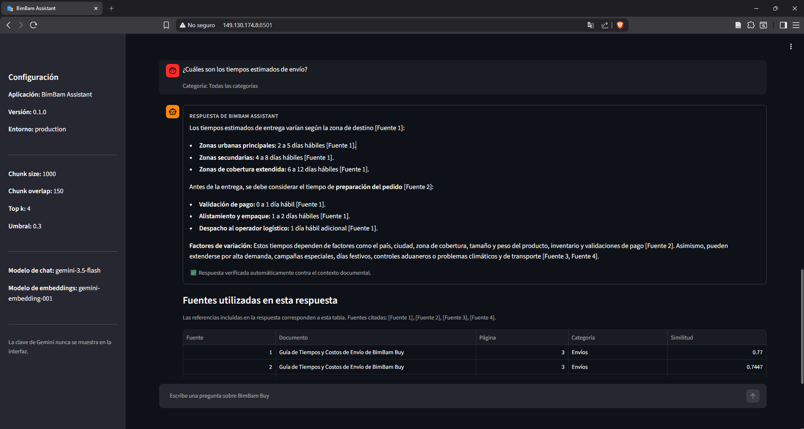
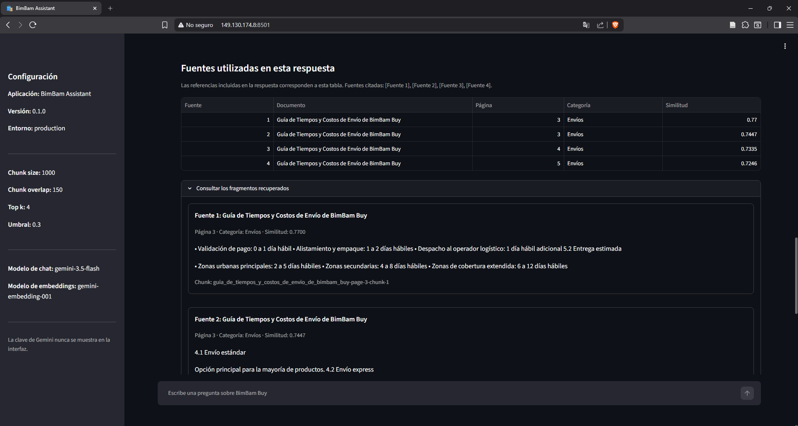
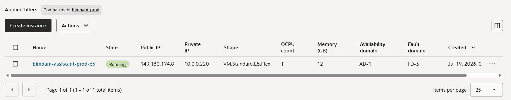
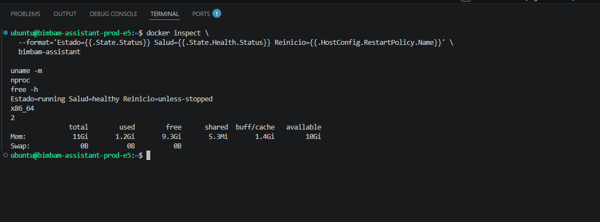

# BimBam Assistant

Agente de inteligencia artificial basado en **RAG** (*Retrieval-Augmented Generation*) para consultar las políticas y documentos corporativos de BimBam Buy mediante preguntas en lenguaje natural.

## Descripción

BimBam Assistant procesa un corpus documental corporativo, recupera los fragmentos más relevantes para cada consulta, genera una respuesta con Gemini y ejecuta una verificación independiente antes de mostrarla.

El asistente cubre consultas sobre:

- Tiempos y costos de envío.
- Seguimiento e incidencias logísticas.
- Garantías de productos.
- Reembolsos y devoluciones.
- Métodos de pago.
- Programa de afiliados.

Las respuestas se restringen al contexto documental recuperado y conservan trazabilidad mediante referencias como `[Fuente 1]`, junto con el documento, la página, la categoría y el fragmento de origen.

## Estado del proyecto

**Fase actual: versión funcional desplegada y validada públicamente en Oracle Cloud Infrastructure mediante Docker.**

El proyecto ya permite:

- Procesar cinco documentos PDF.
- Extraer y limpiar el texto página por página.
- Conservar metadatos de documento, categoría y página.
- Generar 108 chunks trazables.
- Crear embeddings con Gemini.
- Construir y persistir un índice FAISS.
- Transformar preguntas en embeddings.
- Aplicar búsqueda semántica, `top k`, umbral y filtros.
- Ensamblar el contexto documental.
- Generar respuestas con Gemini.
- Validar automáticamente las citas.
- Verificar semánticamente el respaldo de la respuesta.
- Rechazar respuestas no sustentadas.
- Evitar la generación cuando no existe evidencia suficiente.
- Mantener un historial conversacional durante la sesión.
- Interpretar preguntas de seguimiento usando las preguntas recientes.
- Mostrar fuentes y detalles técnicos de forma desplegable.
- Registrar feedback positivo o negativo por respuesta.
- Persistir interacciones, errores, tiempos y feedback en SQLite.
- Mostrar métricas de calidad y posibles vacíos de conocimiento.
- Reintentar automáticamente fallos transitorios de verificación.
- Calcular firmas SHA-256 de los documentos del corpus.
- Detectar documentos agregados, modificados, eliminados o sin cambios.
- Mantener un banco de 20 preguntas para evaluar recuperación, generación, citas y fallback.
- Validar el banco y simular el presupuesto sin consumir llamadas de Gemini.
- Ejecutar evaluaciones por lotes con un límite diario protegido.
- Construir una imagen Docker Linux reproducible.
- Incluir y validar el índice FAISS dentro de la imagen.
- Ejecutar Streamlit en un contenedor con variables proporcionadas en tiempo de ejecución.
- Verificar automáticamente la salud del contenedor mediante `HEALTHCHECK`.
- Desplegar la imagen `linux/amd64` en Oracle Cloud Infrastructure.
- Publicar Streamlit mediante una dirección IPv4 y el puerto `8501`.
- Reiniciar automáticamente Docker y el contenedor después de reiniciar la instancia.
- Conservar configuración y datos de ejecución mediante montajes persistentes en `/opt/bimbam`.
- Restringir el acceso SSH mediante un Network Security Group.
- Ofrecer contactos sintéticos de demostración únicamente durante un fallback.

### Resultado actual

| Métrica | Resultado |
|---|---:|
| Documentos PDF | 5 |
| Páginas procesadas | 57 |
| Chunks generados | 108 |
| Vectores almacenados | 108 |
| Dimensión de cada embedding | 3072 |
| Categorías reconocidas | 5 |
| Resultados recuperados por defecto | 4 |
| Umbral mínimo configurado | 0.30 |
| Confianza mínima de verificación | 0.75 |

### Estado de los componentes

| Componente | Estado |
|---|---|
| Extracción y limpieza | Completadas |
| Fragmentación y metadatos | Completados |
| Embeddings de documentos | Completados |
| Índice FAISS | Completado |
| Embedding de consultas | Completado |
| Recuperación semántica | Completada |
| Filtros y umbral | Completados |
| Ensamblaje del contexto | Completado |
| Generación RAG | Completada |
| Citas `[Fuente N]` | Implementadas |
| Validación determinística de citas | Implementada |
| Verificación semántica estructurada | Implementada |
| Rechazo de respuestas no respaldadas | Implementado |
| Fallback sin evidencia | Implementado |
| Contactos sintéticos de demostración | Implementados |
| Interfaz conversacional Streamlit | Implementada |
| Historial durante la sesión | Implementado |
| Feedback por respuesta | Implementado |
| Persistencia SQLite | Implementada |
| Monitoreo de calidad | Implementado |
| Reranking | Mejora futura opcional |
| Detección de cambios por SHA-256 | Implementada |
| Integración del detector con la indexación | Implementada |
| Omisión de indexación cuando no hay cambios | Implementada |
| Reconstrucción manual con `--force` | Implementada |
| Aviso de sincronización en Streamlit | Implementado |
| Bloqueo del chat con índice desactualizado | Implementado |
| Ejecutor programable para Windows | Implementado y probado |
| Preparación de cron para Linux/OCI | Implementada |
| Activación de cron en OCI | Opcional; no activada en el despliegue temporal |
| Banco de evaluación de 20 preguntas | Implementado |
| Validador offline del banco | Implementado |
| Evaluador RAG con presupuesto diario | Implementado |
| Ejecución real de los lotes | Opcional; evaluador preparado y validado offline |
| Imagen Docker `linux/amd64` | Construida |
| Índice FAISS incluido en la imagen | Validado |
| Ejecución local del contenedor | Completada |
| Healthcheck del contenedor | `healthy` |
| Persistencia de producción en `/opt/bimbam` | Configurada |
| Reinicio automático tras reiniciar la instancia | Validado |
| Acceso SSH restringido mediante NSG | Configurado |
| Triaje y orquestación con LangGraph | Mejora futura opcional |
| Despliegue en OCI | Completado y validado públicamente |

## Tecnologías

- Python 3.11.
- LangChain Core.
- LangChain Google GenAI.
- LangChain Text Splitters.
- LangGraph.
- Google Gemini.
- PyMuPDF.
- FAISS CPU.
- NumPy.
- Streamlit.
- SQLite.
- python-dotenv.
- Pydantic.
- Pytest.
- Docker.

## Arquitectura

| Capa | Responsabilidad |
|---|---|
| `core` | Configuración, variables de entorno y rutas |
| `domain` | Modelos de recuperación, respuesta, verificación y contactos |
| `application` | Indexación, recuperación, generación y verificación |
| `infrastructure` | Integraciones con PDF, Gemini, FAISS, SQLite y detección de cambios documentales |
| `app.py` | Interfaz conversacional, sincronización documental y paneles de monitoreo en Streamlit |

### Flujo completo

```text
PDF
 ↓
Extracción y limpieza
 ↓
Chunks con metadatos
 ↓
Embeddings
 ↓
FAISS
 ↓
Pregunta del usuario
 ↓
Embedding de consulta
 ↓
Top k + umbral + filtros
 ↓
Contexto documental
 ↓
Gemini genera respuesta
 ↓
Validación de citas
 ↓
Gemini verifica respaldo semántico
 ↓
Respuesta verificada o fallback seguro
 ↓
Feedback y métricas en SQLite
```

## Corpus documental

Los documentos están en:

```text
data/documents/
```

El corpus contiene:

1. Guía de Tiempos y Costos de Envío de BimBam Buy.
2. Manual de Garantía de Productos de BimBam Buy.
3. Política de Reembolsos y Devoluciones de BimBam.
4. Preguntas Frecuentes sobre Métodos de Pago de BimBam Buy.
5. Programa de Afiliados de BimBam Buy.

Los documentos mencionan áreas y canales generales de atención, pero no contienen direcciones de correo, teléfonos o URL concretas. Por esa razón, los contactos mostrados por el fallback son datos sintéticos de demostración y no forman parte de la base de conocimiento.

## Estructura del proyecto

```text
bimbam-buy-ai-agent/
├── .dockerignore
├── .env.example
├── .gitignore
├── app.py
├── Dockerfile
├── README.md
├── requirements.txt
├── bimbam_assistant/
│   ├── __init__.py
│   ├── application/
│   │   ├── __init__.py
│   │   ├── agent_service.py
│   │   ├── indexing_service.py
│   │   ├── rag_service.py
│   │   └── verification_service.py
│   ├── core/
│   │   ├── __init__.py
│   │   └── config.py
│   ├── domain/
│   │   ├── __init__.py
│   │   ├── models.py
│   │   └── support_contacts.py
│   └── infrastructure/
│       ├── __init__.py
│       ├── document_change_detector.py
│       ├── faiss_store.py
│       ├── gemini_provider.py
│       ├── monitoring_repository.py
│       └── pdf_loader.py
├── data/
│   ├── documents/
│   │   ├── Guía de Tiempos y Costos de Envío de BimBam Buy.pdf
│   │   ├── Manual de Garantía de Productos de BimBam Buy.pdf
│   │   ├── Política de Reembolsos y Devoluciones de BimBam.pdf
│   │   ├── Preguntas Frecuentes sobre Métodos de Pago de BimBam Buy.pdf
│   │   └── Programa de Afiliados de BimBam Buy.pdf
│   └── evaluation/
│       └── questions.json
├── docs/
│   └── images/
│       ├── app-publica-oci.png
│       ├── respuesta-rag-oci.png
│       ├── instancia-oci-running.png
│       └── docker-healthy-oci.png
├── scripts/
│   ├── evaluate_rag.py
│   ├── index_documents.py
│   ├── install_linux_cron.sh
│   ├── install_windows_index_task.ps1
│   ├── run_index_maintenance.ps1
│   ├── run_index_maintenance.sh
│   └── validate_evaluation_bank.py
├── storage/
│   ├── .gitkeep
│   ├── faiss_index/
│   ├── maintenance/
│   └── monitoring/
└── tests/
    ├── test_chunking.py
    ├── test_document_change_detector.py
    ├── test_evaluate_rag.py
    ├── test_evaluation_bank.py
    ├── test_index_documents_conditional.py
    ├── test_pdf_loader.py
    ├── test_rag_service.py
    ├── test_retrieval.py
    └── test_verification_retry.py
```

Los archivos `__init__.py` se mantienen vacíos de forma intencional para
identificar los paquetes de Python. La interfaz se ejecuta directamente
desde `app.py`; por esta razón, ya no existe una carpeta `presentation/`.
El notebook utilizado durante el aprendizaje tampoco forma parte de la
versión final del repositorio.

### Archivos versionados y archivos generados

Los documentos del corpus, el banco de evaluación, el código fuente, las
pruebas, los scripts y las evidencias visuales de `docs/images/` se almacenan en GitHub. En cambio, los secretos,
índices, bases de datos, logs y resultados de ejecución se generan
localmente y permanecen excluidos mediante `.gitignore`.

| Ruta | Cómo se obtiene | Contenido principal | ¿Se almacena en Git? |
|---|---|---|---|
| `docs/images/` | Capturas obtenidas durante la validación del despliegue | Evidencias de OCI, Docker y la aplicación pública | Sí |
| `.env` | Se crea copiando `.env.example` | Clave de Gemini y configuración privada | No |
| `storage/faiss_index/` | `python scripts/index_documents.py` | `index.faiss`, `documents.json`, `manifest.json` y `corpus_manifest.json` | No |
| `storage/monitoring/` | La aplicación Streamlit la crea al registrar interacciones | `bimbam_quality.db` | No |
| `storage/maintenance/` | Los scripts de mantenimiento la crean al ejecutarse | Logs de indexación y mantenimiento | No |
| `storage/evaluation/` | `evaluate_rag.py --execute` la crea en la primera evaluación real | Presupuesto diario y resultados de los lotes | No |
| `__pycache__/` y `.pytest_cache/` | Python y Pytest las crean automáticamente | Cachés temporales | No |

La carpeta raíz `storage/` se conserva en el repositorio mediante
`storage/.gitkeep`. Sus subcarpetas pueden existir vacías antes de la
primera ejecución. En particular, `storage/evaluation/` no aparece hasta
que se ejecuta una evaluación real.

#### Contenido generado en `storage/faiss_index/`

```text
storage/faiss_index/
├── index.faiss
├── documents.json
├── manifest.json
└── corpus_manifest.json
```

- `index.faiss`: vectores normalizados para la búsqueda semántica.
- `documents.json`: chunks y metadatos asociados a cada vector.
- `manifest.json`: modelo, dimensión, cantidad de vectores y parámetros.
- `corpus_manifest.json`: firmas SHA-256 utilizadas para detectar cambios.

#### Contenido generado en `storage/monitoring/`

```text
storage/monitoring/
└── bimbam_quality.db
```

La base SQLite se crea durante la ejecución de Streamlit cuando el sistema
registra interacciones, errores, tiempos o feedback.

#### Contenido generado en `storage/maintenance/`

```text
storage/maintenance/
└── *.log
```

Los archivos de log se generan cuando se ejecutan los scripts de
mantenimiento manual o programado. Sus nombres pueden variar según el
script y la fecha de ejecución.

#### Contenido generado en `storage/evaluation/`

```text
storage/evaluation/
├── gemini_budget.json
└── runs/
    └── rag-evaluation-<modo>-<fecha>/
        ├── results.jsonl
        ├── summary.csv
        └── summary.json
```

Esta carpeta se crea únicamente al ejecutar una evaluación real con
`--execute`. Las simulaciones de presupuesto y las validaciones offline
no generan llamadas a Gemini.


## Instalación local

### 1. Clonar el repositorio

```bash
git clone https://github.com/JSarabino/bimbam-buy-ai-agent.git
cd bimbam-buy-ai-agent
```

### 2. Crear el entorno

#### Windows con Conda

```powershell
conda create --prefix .\.venv python=3.11 -y
conda activate .\.venv
```

#### Windows con `venv`

```powershell
python -m venv .venv
.\.venv\Scripts\Activate.ps1
```

#### Linux o macOS

```bash
python3.11 -m venv .venv
source .venv/bin/activate
```

### 3. Instalar dependencias

```bash
python -m pip install --upgrade pip
python -m pip install -r requirements.txt
python -m pip check
```

### 4. Configurar variables

#### Windows

```powershell
Copy-Item .env.example .env
```

#### Linux o macOS

```bash
cp .env.example .env
```

Agregar la clave:

```env
GOOGLE_API_KEY=tu_clave
```

El archivo `.env` es privado y no debe subirse al repositorio.

### 5. Generar el índice

```bash
python scripts/index_documents.py
```

El índice se guarda localmente en:

```text
storage/faiss_index/
├── index.faiss
├── documents.json
├── manifest.json
└── corpus_manifest.json
```

Este directorio debe reconstruirse después de clonar el repositorio.


## Ejecución y validación con Docker

La aplicación fue construida y ejecutada correctamente como un contenedor
Linux mediante Docker Desktop con backend WSL 2.

### Resultado validado

| Elemento | Resultado |
|---|---|
| Imagen | `bimbam-assistant:0.1.0` |
| Plataforma | `linux/amd64` |
| Puerto interno | `8501` |
| Puerto local de prueba | `127.0.0.1:8501` |
| Estado del contenedor | `running` |
| Estado de salud | `healthy` |
| Usuario del contenedor | `appuser` |
| Índice FAISS incluido | Sí |

El índice se incorpora durante la construcción de la imagen para evitar
una nueva generación de embeddings al iniciar cada contenedor. La imagen
contiene:

```text
/app/storage/faiss_index/
├── index.faiss
├── documents.json
├── manifest.json
└── corpus_manifest.json
```

El archivo `.env` no se copia dentro de la imagen. Las variables privadas
se proporcionan durante la ejecución mediante `--env-file` o mediante la
configuración segura del entorno de despliegue.

### Construcción

```bash
docker build --progress=plain -t bimbam-assistant:0.1.0 .
```

La construcción se detiene si falta alguno de los archivos obligatorios
del índice.

### Verificación del índice dentro de la imagen

```powershell
docker run `
  --rm `
  --entrypoint sh `
  bimbam-assistant:0.1.0 `
  -c "test -s /app/storage/faiss_index/index.faiss &&
      test -s /app/storage/faiss_index/documents.json &&
      test -s /app/storage/faiss_index/manifest.json &&
      test -s /app/storage/faiss_index/corpus_manifest.json &&
      echo 'Índice FAISS completo'"
```

Resultado validado:

```text
Índice FAISS completo
```

### Ejecución local

```powershell
docker run `
  -d `
  --name bimbam-assistant-local `
  --env-file .\.env `
  -e APP_ENV=production `
  -p 127.0.0.1:8501:8501 `
  bimbam-assistant:0.1.0
```

La aplicación queda disponible en:

```text
http://localhost:8501
```

El uso de `127.0.0.1` limita esta validación al equipo local y no constituye
todavía un despliegue público.

### Verificación del estado

```powershell
docker inspect `
  --format "{{.State.Status}} | {{if .State.Health}}{{.State.Health.Status}}{{else}}sin-healthcheck{{end}}" `
  bimbam-assistant-local
```

Resultado obtenido:

```text
running | healthy
```

### Logs

```powershell
docker logs --tail 100 bimbam-assistant-local
```

### Detener y eliminar el contenedor local

```powershell
docker stop bimbam-assistant-local
docker rm bimbam-assistant-local
```

La eliminación del contenedor no elimina la imagen construida.


## Despliegue en Oracle Cloud Infrastructure

BimBam Assistant fue desplegado en una instancia de Oracle Cloud
Infrastructure mediante la misma imagen Docker validada localmente.

### Entorno de producción

| Elemento | Configuración |
|---|---|
| Proveedor | Oracle Cloud Infrastructure |
| Región | Colombia Central (Bogotá) |
| Instancia | `bimbam-assistant-prod-e5` |
| Sistema operativo | Ubuntu 24.04 LTS |
| Shape | `VM.Standard.E5.Flex` |
| Recursos asignados | 1 OCPU, 12 GB de RAM |
| Procesadores visibles en Linux | 2 |
| Arquitectura | `x86_64` / `linux/amd64` |
| Imagen Docker | `bimbam-assistant:0.1.0` |
| Puerto publicado | `8501` |
| Estado validado | `running / healthy` |
| Política de reinicio | `unless-stopped` |

La aplicación se encuentra disponible durante el periodo de evaluación en:

```text
http://149.130.174.8:8501
```

La dirección utiliza HTTP sin certificado TLS, por lo que el navegador
puede mostrar la indicación **No seguro**. La IP corresponde a una
dirección pública de la instancia y su disponibilidad depende de que el
recurso permanezca encendido durante el periodo de evaluación.

### Persistencia y configuración

La imagen contiene el código, las dependencias y el índice FAISS inicial.
La configuración privada y los datos generados se conservan fuera del
contenedor:

```text
/opt/bimbam/
├── config/
│   └── bimbam.env
├── monitoring/
├── maintenance/
└── evaluation/
```

Los montajes utilizados son:

```text
/opt/bimbam/monitoring   → /app/storage/monitoring
/opt/bimbam/maintenance  → /app/storage/maintenance
/opt/bimbam/evaluation   → /app/storage/evaluation
```

El archivo `bimbam.env` tiene permisos restringidos y no se almacena en
GitHub. El contenedor fue configurado con `--restart unless-stopped`, por
lo que Docker y la aplicación se recuperaron automáticamente después de
reiniciar la instancia.

### Red y acceso

- El puerto `8501` está habilitado públicamente para acceder a Streamlit.
- El puerto `22` está restringido a una dirección IPv4 autorizada mediante un Network Security Group.
- Se eliminó la regla general que permitía SSH desde `0.0.0.0/0`.
- La administración del servidor se realiza mediante SSH y VS Code Remote SSH.

### Evidencias del despliegue

#### Aplicación pública y respuesta verificada



#### Fuentes y fragmentos recuperados



#### Instancia de Oracle Cloud en ejecución



#### Salud del contenedor y recursos del servidor



### Operación básica

```bash
# Estado del contenedor
docker ps

# Estado y healthcheck
docker inspect   --format='Estado={{.State.Status}} Salud={{.State.Health.Status}} Reinicio={{.HostConfig.RestartPolicy.Name}}'   bimbam-assistant

# Logs recientes
docker logs --tail 100 bimbam-assistant

# Reiniciar la aplicación
docker restart bimbam-assistant
```

## Generación RAG

La función principal es:

```python
from bimbam_assistant.application.rag_service import answer_question

response = answer_question(
    "¿Cuánto tarda un reembolso?"
)

print(response.answer)
print(response.verification.status)
print(response.verification.confidence)
```

`RagResponse` contiene:

- Pregunta normalizada.
- Respuesta final.
- Recuperación utilizada.
- Modelo generativo.
- Indicador de uso del contexto.
- Verificación automática.
- Fuentes documentales.
- Contacto sintético opcional para el fallback.

## Verificación automática

La verificación aplica dos controles.

### 1. Validación determinística

Se extraen las referencias con formato:

```text
[Fuente 1]
[Fuente 2]
```

Después se comprueba que:

- Exista al menos una cita cuando hay evidencia.
- Cada número citado corresponda a una fuente recuperada.
- No aparezcan referencias inexistentes como `[Fuente 99]`.

### 2. Verificación semántica

Un segundo llamado estructurado a Gemini compara:

- La pregunta.
- La respuesta generada.
- El contexto documental autorizado.

El verificador devuelve:

- `status`: `verified`, `rejected` o `not_applicable`.
- `passed`.
- `semantic_supported`.
- `confidence`.
- `cited_sources`.
- `invalid_citations`.
- `unsupported_claims`.
- `explanation`.

La respuesta se acepta únicamente cuando:

```text
contenido respaldado
AND confianza >= 0.75
AND existen citas
AND no hay citas inválidas
```

Cuando la validación falla, la respuesta original no se muestra y se reemplaza por un mensaje seguro.

## Interfaz conversacional

Ejecutar:

```bash
python -m streamlit run app.py
```

La aplicación estará disponible normalmente en:

```text
http://localhost:8501
```

La interfaz incluye:

- Indicación explícita de que se conversa con un asistente de IA.
- Mensaje inicial con ejemplos de preguntas.
- Campo de chat.
- Filtro opcional por categoría.
- Historial de preguntas y respuestas durante la sesión.
- Continuidad básica para preguntas de seguimiento.
- Respuesta destacada visualmente.
- Feedback `👍 Útil` y `👎 No útil`.
- Fuentes, verificación y contexto en paneles desplegables.
- Botón para iniciar una conversación nueva.
- Métricas técnicas compactas.
- Panel de monitoreo de calidad.

Las últimas preguntas ayudan a interpretar seguimientos como:

```text
Usuario: ¿Cuánto tarda un reembolso?
Usuario: ¿Y si pagué en cuotas?
```

Las respuestas anteriores no se usan como evidencia. El sistema vuelve a consultar el corpus para cada pregunta.


## Reintentos automáticos de verificación

La verificación estructurada incorpora un reintento controlado para errores temporales del proveedor.

Se reintenta ante señales como:

```text
429
500
502
503
504
rate limit
resource exhausted
service unavailable
timeout
deadline exceeded
```

Configuración actual:

```python
VERIFICATION_MAX_ATTEMPTS = 2
VERIFICATION_RETRY_BASE_SECONDS = 2.0
```

Esto representa un intento inicial y un único reintento automático después de una espera de dos segundos.

No se reintenta cuando:

- La respuesta estructurada se generó correctamente.
- El verificador concluye que la respuesta no está respaldada.
- Existen citas inválidas.
- El error corresponde a una condición permanente de esquema o configuración.

Pruebas implementadas:

```bash
python -m pytest tests/test_verification_retry.py -v
```

Resultado validado:

```text
4 passed
```


## Pruebas automáticas

La suite utiliza Pytest y cubre el flujo principal sin realizar llamadas
reales a Gemini durante las pruebas unitarias.

```bash
python -m pytest -v
```

Resultado validado antes de la preparación del despliegue:

```text
78 passed in 1.58s
```

Cobertura principal:

- Limpieza, localización y extracción de documentos PDF.
- Fragmentación, metadatos y validación de chunks.
- Recuperación semántica, filtros, umbral y construcción del contexto.
- Generación RAG, verificación aprobada, rechazo y fallback.
- Reintentos transitorios del verificador.
- Detección de cambios documentales.
- Indexación condicional y opción `--force`.
- Validación del banco de evaluación.
- Simulación y control preventivo del presupuesto diario.

Los tests reemplazan embeddings, generación y verificación mediante
mocks, por lo que no consumen la cuota de Gemini.

## Detección de cambios documentales

El módulo:

```text
bimbam_assistant/infrastructure/document_change_detector.py
```

calcula una firma SHA-256 por cada PDF del corpus.

Cada firma incluye:

```text
relative_path
sha256
size_bytes
```

El detector clasifica los documentos como:

```text
added
modified
deleted
unchanged
```

El manifiesto del corpus se almacena en:

```text
storage/faiss_index/corpus_manifest.json
```

Ejemplo de estructura:

```json
{
  "schema_version": 1,
  "hash_algorithm": "sha256",
  "document_count": 5,
  "documents": [
    {
      "relative_path": "Manual de Garantía de Productos de BimBam Buy.pdf",
      "sha256": "firma-del-documento",
      "size_bytes": 24583
    }
  ]
}
```

La primera inspección marca los cinco PDF como agregados cuando todavía no existe un manifiesto previo.

Pruebas implementadas:

```bash
python -m pytest tests/test_document_change_detector.py -v
```

Resultado validado:

```text
6 passed
```

El detector está integrado con `scripts/index_documents.py`. La indexación se omite cuando el corpus no cambia y puede forzarse con `--force`.

El flujo implementado es:

```text
calcular hashes
→ comparar manifiestos
→ omitir indexación si no hay cambios
→ reconstruir FAISS si cambia el corpus
→ guardar el nuevo manifiesto
```

## Monitoreo persistente

La aplicación crea automáticamente:

```text
storage/monitoring/bimbam_quality.db
```

La base SQLite registra:

- Pregunta original.
- Consulta contextual utilizada.
- Categoría.
- Respuesta final.
- Resultado de la interacción.
- Estado y confianza de verificación.
- Cantidad y resumen de fuentes.
- Modelo generativo.
- Tiempo total de respuesta.
- Feedback positivo o negativo.
- Errores transitorios.

Los resultados posibles son:

```text
answered
no_evidence
rejected
error
```

El panel **Monitoreo de calidad** muestra:

- Consultas registradas.
- Preguntas sin evidencia.
- Respuestas rechazadas.
- Errores.
- Latencia promedio.
- Feedback positivo y negativo.
- Tasa de feedback.
- Interacciones recientes.
- Posibles vacíos de conocimiento.

Se consideran posibles vacíos:

- Consultas sin evidencia.
- Respuestas rechazadas.
- Errores.
- Respuestas con feedback negativo.

## Persistencia y privacidad

El historial visual del chat se conserva durante la sesión actual de Streamlit.

Las métricas y el feedback se conservan en SQLite después de cerrar la aplicación. Debido a que pueden incluir preguntas y respuestas, la base local no debe subirse a GitHub.

Las siguientes rutas se mantienen excluidas mediante `.gitignore`:

```gitignore
storage/faiss_index/
storage/monitoring/
storage/maintenance/
storage/evaluation/
```

Verificar:

```powershell
git check-ignore storage/faiss_index/index.faiss
git check-ignore storage/monitoring/bimbam_quality.db
git check-ignore storage/maintenance/index-maintenance.log
git check-ignore storage/evaluation/gemini_budget.json
```

## Fallback y contactos sintéticos

### Sin evidencia

Cuando ningún fragmento supera el umbral:

- No se invoca el modelo generativo.
- No se invoca el verificador.
- Se devuelve un mensaje explícito.
- El estado es `not_applicable`.

### Respuesta rechazada

Cuando el modelo genera contenido no respaldado:

- El verificador marca `rejected`.
- La respuesta se descarta.
- Se muestra un fallback seguro.
- Se registra la interacción para auditoría.

Los contactos alternativos usan direcciones bajo `example.com`:

```text
postventa-bimbam@example.com
```

Son ficticios, no se indexan, no se citan como fuentes y deben sustituirse antes de un uso productivo.

## Consumo de API

Una consulta con evidencia normalmente utiliza:

```text
1 solicitud de embedding
1 solicitud de generación
1 solicitud de verificación
```

Una consulta sin evidencia utiliza únicamente el embedding de la pregunta.

Los fallos transitorios de la verificación se reintentan automáticamente una vez. Si ambos intentos fallan, la interacción se registra como error en SQLite.

## Pruebas manuales realizadas

### Respuesta válida

Consulta:

```text
¿Cuánto tarda un reembolso?
```

Resultado observado:

```text
Estado: verified
Confianza: 1.0
Citas: [1, 2, 3]
Citas inválidas: []
Afirmaciones no respaldadas: []
```

### Respuesta falsa

Afirmación de prueba:

```text
El reembolso tarda exactamente 90 días calendario
y se paga en criptomonedas [Fuente 99].
```

El verificador detectó:

- Plazo no respaldado.
- Medio de pago inventado.
- Fuente inexistente.

### Seguimiento conversacional

Secuencia:

```text
¿Cuánto tarda un reembolso?
¿Y si pagué en cuotas?
```

El asistente utilizó las preguntas recientes para interpretar el seguimiento y volvió a recuperar evidencia documental.


## Mantenimiento documental programable

El pipeline documental ya está integrado con el detector SHA-256.

Comportamiento:

```text
Ejecutar index_documents.py
→ comparar corpus y manifiesto
→ omitir el proceso si no hay cambios
→ reconstruir FAISS si hay cambios
→ guardar corpus_manifest.json
```

Comandos:

```bash
python scripts/index_documents.py
python scripts/index_documents.py --force
```

La interfaz Streamlit compara el corpus actual con el manifiesto y
deshabilita el chat cuando el índice está desactualizado.

El proyecto incluye:

```text
scripts/run_index_maintenance.ps1
scripts/install_windows_index_task.ps1
scripts/run_index_maintenance.sh
scripts/install_linux_cron.sh
```

La tarea programada de Windows fue creada, ejecutada y validada
correctamente durante las pruebas. Después fue eliminada del equipo
local, por lo que la capacidad está implementada pero no permanece
activa en ese computador.

Los scripts de Linux están preparados para activar el mantenimiento
periódico mediante cron. En el despliegue temporal de OCI no se dejó una
tarea cron activa, porque el corpus y el índice FAISS están incluidos en
la imagen validada y no se modifican durante el periodo de evaluación.


## Banco de evaluación RAG

El proyecto incluye un banco versionado en:

```text
data/evaluation/questions.json
```

Está compuesto por 20 preguntas organizadas en cinco lotes de cuatro
preguntas:

```text
A, B, C, D y E
```

La cobertura incluye:

- Envíos.
- Garantías.
- Reembolsos y devoluciones.
- Métodos de pago.
- Programa de afiliados.
- Preguntas multidocumento.
- Casos fuera de alcance y fallback.

Cada caso registra la pregunta, la categoría, el tipo, la dificultad,
los documentos y páginas esperados, los hechos que deberían aparecer,
las afirmaciones que no deberían generarse y el comportamiento esperado.

### Validación offline

El banco puede validarse sin consumir Gemini:

```bash
python scripts/validate_evaluation_bank.py
python -m pytest tests/test_evaluation_bank.py -v
```

### Evaluador con control de presupuesto

El ejecutor se encuentra en:

```text
scripts/evaluate_rag.py
```

Funciona en modo simulación mientras no se agregue `--execute`.

```bash
python scripts/evaluate_rag.py --batch A --mode retrieval
python scripts/evaluate_rag.py --batch A --mode full
```

Modos disponibles:

| Modo | Reserva conservadora por pregunta | Lote de 4 |
|---|---:|---:|
| `retrieval` | 1 llamada | 4 llamadas |
| `full` | 4 llamadas | 16 llamadas |

El modo completo reserva una llamada para el embedding de consulta, una
para generación, una para verificación y una posible llamada para el
reintento de verificación.

El límite configurado es de 20 llamadas diarias, con un margen de
seguridad predeterminado de dos llamadas. El presupuesto local se registra
en:

```text
storage/evaluation/gemini_budget.json
```

Los resultados de ejecuciones reales se escribirán en:

```text
storage/evaluation/runs/
```

La evaluación semántica de hechos se deja para revisión humana y para el
verificador ya existente. No se utiliza un juez LLM adicional, porque
añadiría otra llamada de Gemini por pregunta.

### Estado de ejecución

La estructura del banco, el validador, las pruebas offline, el planificador
y el contador preventivo ya están implementados. La ejecución real de los
lotes es opcional y no forma parte del despliegue de la aplicación. Puede
realizarse localmente o mediante la misma imagen Docker para obtener métricas
adicionales, teniendo en cuenta que consume la cuota diaria de Gemini.

## Seguridad y limitaciones

- `.env` no se almacena en Git.
- La clave de Gemini no se muestra.
- El modelo recibe los documentos como contexto, no como instrucciones.
- Las respuestas no verificadas se descartan.
- Los contactos sintéticos están explícitamente marcados.
- La base SQLite local no se sube al repositorio.
- La verificación con otro LLM reduce el riesgo, pero no constituye una garantía matemática.
- Cada verificación agrega latencia y consumo de API.
- El historial completo no se restaura entre sesiones.
- El mantenimiento puede ejecutarse manualmente o programarse; el cron de OCI no se dejó activo en este despliegue temporal.
- El contador de evaluación solo conoce las llamadas reservadas por `evaluate_rag.py`; no puede observar consumos realizados desde Streamlit, la indexación u otros scripts.
- Las evaluaciones reales del banco siguen pendientes de una ventana con cuota suficiente.
- El reranking todavía no forma parte del baseline.
- El despliegue público utiliza HTTP sin TLS.
- La dirección pública estará disponible únicamente mientras la instancia OCI permanezca encendida durante el periodo de evaluación.


## Mejoras futuras opcionales

Una evolución posible consiste en incorporar LangGraph para representar
el flujo como un grafo de estados con triaje, rutas condicionales y
orquestación de herramientas.

Esta mejora no forma parte de los requisitos obligatorios del Challenge.
El sistema actual ya funciona como un agente RAG documental capaz de:

- Recuperar evidencia semántica desde FAISS.
- Generar respuestas fundamentadas con Gemini.
- Verificar citas y respaldo documental.
- Rechazar respuestas no sustentadas.
- Activar un fallback controlado.
- Bloquear consultas cuando el índice está desactualizado.

Un triaje basado en LLM añadiría al menos una llamada adicional por
consulta, por lo que se mantiene como mejora futura debido al límite
diario de uso de Gemini.

El reranking también se conserva como mejora futura opcional. Su propósito
sería reordenar los fragmentos recuperados antes de construir el contexto,
pero el baseline actual ya recupera evidencia suficiente mediante FAISS,
`top k`, umbral de similitud y filtros.

`bimbam_assistant/application/agent_service.py` se conserva como punto de extensión para una futura orquestación con LangGraph. No forma parte del flujo obligatorio de la versión actual.

## Próximas etapas

1. Mantener la instancia y el contenedor disponibles durante el periodo de evaluación.
2. Supervisar periódicamente el estado `running / healthy`.
3. Ejecutar los lotes del banco cuando exista cuota suficiente de Gemini.
4. Evaluar un dominio y HTTPS si el proyecto evoluciona hacia un servicio permanente.
5. Activar cron únicamente si el corpus documental cambia en producción.
6. Terminar la instancia y eliminar su volumen de arranque al concluir la evaluación para detener el consumo de recursos.

## Alcance actual

```text
PDF
  → extracción
  → chunks
  → embeddings
  → FAISS
  → recuperación
  → generación
  → verificación automática
  → respuesta verificada o fallback
  → feedback y monitoreo persistente
  → control de cambios documentales por SHA-256

Banco de evaluación
  → validación offline
  → simulación de presupuesto
  → ejecución controlada por lotes

Despliegue
  → imagen Docker `linux/amd64`
  → instancia OCI con Ubuntu 24.04
  → Streamlit público en el puerto 8501
  → persistencia en `/opt/bimbam`
  → reinicio automático validado
```

## Autor

Proyecto desarrollado por **Juan Camilo Sarabino** como desafío final de formación en agentes de inteligencia artificial y recuperación aumentada por generación.
