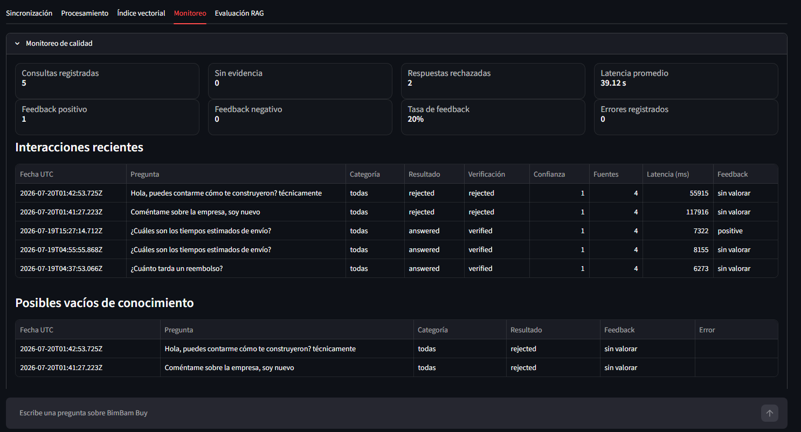

# BimBam Assistant


Agente de inteligencia artificial basado en **RAG** (*Retrieval-Augmented
Generation*) que responde preguntas sobre documentos corporativos de
BimBam Buy, cita la evidencia recuperada y verifica automáticamente cada
respuesta antes de mostrarla.

**[Abrir aplicación pública](http://149.130.174.8:8501)** ·
**[Consultar documentación técnica](docs/DOCUMENTACION_TECNICA.md)**

> La aplicación permanecerá disponible durante el periodo de evaluación.
> El despliegue actual utiliza HTTP sin certificado TLS.

## Demostración


## Funcionalidades principales

- Procesa cinco PDF y conserva metadatos de documento, página y categoría.
- Recupera fragmentos mediante embeddings de Gemini y FAISS.
- Genera respuestas con citas en formato `[Fuente N]`.
- Valida las citas y verifica el respaldo documental.
- Rechaza respuestas no sustentadas y activa un fallback seguro.
- Registra consultas, fuentes, latencia, errores y feedback en SQLite.
- Detecta cambios del corpus mediante firmas SHA-256.
- Incluye un banco de 20 preguntas para evaluación controlada.
- Se ejecuta en Docker y está desplegado en Oracle Cloud Infrastructure.

## Arquitectura

```text
PDF → limpieza → chunks → embeddings → FAISS
                                      ↓
Pregunta → recuperación → contexto → Gemini
                                      ↓
                validación de citas + verificación semántica
                                      ↓
             respuesta verificada o fallback → monitoreo SQLite
```

| Capa | Responsabilidad |
|---|---|
| `core` | Configuración y rutas |
| `domain` | Modelos de dominio |
| `application` | Indexación, RAG y verificación |
| `infrastructure` | PDF, Gemini, FAISS, SQLite y detección de cambios |
| `app.py` | Interfaz Streamlit y paneles técnicos |

## Resultados validados

| Métrica | Resultado |
|---|---:|
| Documentos | 5 |
| Páginas | 57 |
| Chunks y vectores | 108 |
| Dimensión de embeddings | 3072 |
| Categorías | 5 |
| Pruebas automáticas | 78 aprobadas |
| Contenedor | `running / healthy` |
| Despliegue | OCI, `linux/amd64` |

## Tecnologías

Python 3.11, Streamlit, LangChain, Google Gemini, PyMuPDF, FAISS CPU,
SQLite, Pydantic, Pytest, Docker y Oracle Cloud Infrastructure. LangGraph
se conserva como punto de extensión opcional.

## Instalación local

```bash
git clone https://github.com/JSarabino/bimbam-buy-ai-agent.git
cd bimbam-buy-ai-agent
python -m venv .venv
python -m pip install --upgrade pip
python -m pip install -r requirements.txt
```

Configura Gemini:

```bash
cp .env.example .env
```

En Windows PowerShell:

```powershell
Copy-Item .env.example .env
```

Completa la variable sin subir el archivo a Git:

```env
GOOGLE_API_KEY=tu_clave
```

Genera el índice y ejecuta:

```bash
python scripts/index_documents.py
python -m streamlit run app.py
```

La aplicación local queda disponible en `http://localhost:8501`.

## Docker

```bash
docker build -t bimbam-assistant:0.1.0 .

docker run -d \
  --name bimbam-assistant-local \
  --env-file .env \
  -e APP_ENV=production \
  -p 127.0.0.1:8501:8501 \
  bimbam-assistant:0.1.0
```

Comprobar el estado:

```bash
docker inspect \
  --format='{{.State.Status}} | {{.State.Health.Status}}' \
  bimbam-assistant-local
```

Resultado validado:

```text
running | healthy
```

## Despliegue en OCI

| Elemento | Configuración |
|---|---|
| Sistema | Ubuntu 24.04 LTS |
| Shape | `VM.Standard.E5.Flex` |
| Recursos | 1 OCPU, 12 GB RAM |
| Arquitectura | `x86_64` / `linux/amd64` |
| Puerto público | `8501` |
| Reinicio | `unless-stopped` |
| Persistencia | `/opt/bimbam` |

El puerto SSH está restringido mediante un Network Security Group y la
configuración privada se mantiene fuera de la imagen.

<details>
<summary><strong>Ver evidencias del despliegue</strong></summary>

### Fuentes y fragmentos recuperados


### Instancia en ejecución


### Contenedor y recursos


</details>

## Monitoreo y trazabilidad

La base SQLite persistente registra la pregunta, categoría, respuesta,
resultado, verificación, confianza, fuentes, latencia, feedback y errores.
Las interacciones son anónimas porque esta demostración no incorpora
autenticación de usuarios.



## Pruebas

```bash
python -m pytest -v
```

Resultado:

```text
78 passed in 1.58s
```

Las pruebas reemplazan las llamadas reales a Gemini mediante mocks, por lo
que no consumen cuota.

## Estructura principal

```text
bimbam-buy-ai-agent/
├── app.py
├── Dockerfile
├── requirements.txt
├── bimbam_assistant/
├── data/
├── docs/
│   ├── DOCUMENTACION_TECNICA.md
│   └── images/
├── scripts/
├── storage/
└── tests/
```

Los secretos, índices, bases SQLite, logs y resultados de ejecución están
excluidos mediante `.gitignore`.

## Seguridad y limitaciones

- `.env`, la clave de Gemini y la clave SSH no se almacenan en Git.
- Las respuestas no verificadas se descartan.
- Los contactos de fallback bajo `example.com` son sintéticos.
- El historial visual completo no se restaura entre sesiones.
- El despliegue demostrativo utiliza HTTP sin TLS y una sola instancia.
- La verificación añade latencia y consumo de API.

## Mejoras futuras

- Evaluar reranking de fragmentos.
- Incorporar LangGraph para triaje y rutas condicionales.
- Añadir dominio y HTTPS para una publicación permanente.
- Ejecutar opcionalmente los lotes reales del banco de evaluación.
- Activar mantenimiento programado si el corpus cambia en producción.

## Documentación detallada

La explicación completa de indexación, verificación, monitoreo, evaluación,
persistencia, mantenimiento, Docker y OCI está disponible en
[`docs/DOCUMENTACION_TECNICA.md`](docs/DOCUMENTACION_TECNICA.md).

## Autor

Desarrollado por **Juan Camilo Sarabino** como desafío final de formación
en agentes de inteligencia artificial y recuperación aumentada por
generación.
